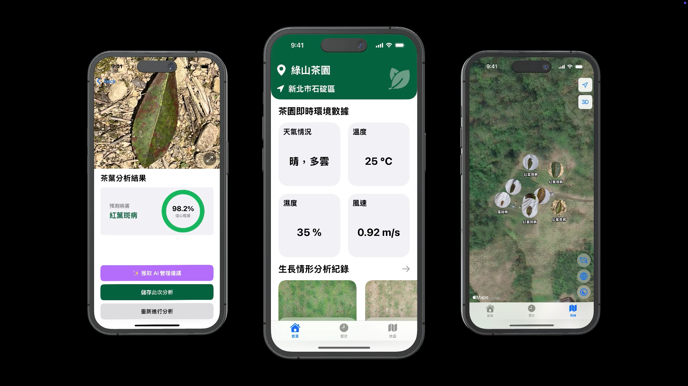

# 茶園監控 App 🌿

> 注意：此專題內所用之茶園名稱僅供示意，非真實茶園名稱，四個茶園均於石碇拍攝。

本專題榮獲「2025 全國技專校院學生實務專題製作競賽」第一名 🏆、「112 年度教育部人文社會永續行動創新應用競賽」優選（第一名）🏆，並獲得新聞媒體報導。在本專題中，我負責 `Swift` 前端、`Express` 後端及 `MongoDB` 資料庫等程式開發工作。

## 相關報導 📰

- [AI辨識助監控茶園病害 致理科大團隊獲專題競賽獎](https://www.cna.com.tw/news/ahel/202505120138.aspx)（本人位於圖左 2）
- [教育部新聞稿 - 2025年全國技專校院學生實務專題製作競賽暨成果展 成績揭曉](https://www.edu.tw/News_Content.aspx?n=9E7AC85F1954DDA8&s=F864BF39692DA8FC)
- [石碇高中生攜手致理科大用無人機及 AI 助茶農 獲教育部首屆永續行動創新獎](https://news.ltn.com.tw/news/life/breakingnews/4752180)（本人位於圖左 3）
- [人文社會永續行動創新應用競賽 跨域展關懷](https://tw.news.yahoo.com/人文社會永續行動創新應用競賽-跨域展關懷-095234806.html)

## 專案介紹 🌐

「茶園監控 App」是一款專為茶農設計的應用程式，使茶農能透過手機查看本團隊拍攝與分析後的茶園影像與數據。前端採用 `Swift` 開發，後端以 `JavaScript` 建構，影像分析由 `Python` 執行，並結合 `Microsoft Azure` 的自訂視覺服務。App 支援病害辨識、病害地圖、AI 管理建議等功能，並以 `Next.js` 製作可匯出 PDF 的茶園報告，協助茶農以科技輔助日常管理。

## 專案分工 🤝

- **無人機影像拍攝**：外聘無人機教練指導拍攝
- **App 介面設計與開發**：我負責整體 UI 設計與 `Swift / SwiftUI` 程式碼撰寫
- **後端 API 與資料庫設計**：我負責 `Express` API 架設與 `MongoDB` 資料庫設計
- **AI 模型訓練**：我負責訓練 `Microsoft Azure` 自訂視覺服務模型
- **影像分析**：其他組員與老師共同完成，使用 `Python` 的 `OpenCV` 和 `NumPy` 進行影像分析
- **後端及資料庫部署**：我負責將後端部署至 `Vercel` 並將資料庫部署至 `MongoDB Atlas`
- **茶園報告**：我負責使用 `Next.js` 與 `Tailwind CSS` 開發茶園報告

## 使用技術 🔧

- **Swift**：進行邏輯撰寫，並使用以下關鍵功能
  - **URLSession**：處理網路請求
  - **Codable**：定義 JSON 資料的模型結構
  - **JSONDecoder**：解析 JSON 資料
- **SwiftUI**：進行狀態管理與建立使用者介面，並使用如 `@State`、`@Binding`、`@StateObject`、`@Published`、`@EnvironmentObject` 等屬性監聽狀態變化與在不同 View 間傳遞資料

## 功能 🚀

- **茶園狀況**：查看所有歷史分析紀錄，包含每次拍攝與分析後的生長率參考值及種植程度等資訊
- **茶園影像**：查看無人機原始所拍攝之茶園影像
- **分析影像**：查看 `Python` 分析後圖片與 `Microsoft Azure` 自訂視覺服務辨識出的種植程度低區域
- **茶園切換**：切換不同茶園的資訊
- **病害辨識**：辨識茶葉疾病，並提供信心程度
- **病害地圖**：以地圖呈現歷史病害發生位置，協助追蹤與觀察區域分布
- **病害熱力圖**：可視化病害發生密集程度，快速掌握高風險區域
- **AI 管理建議**：結合病害名稱、信心程度與天氣情況，提供人性化茶園管理的建議措施與行動方向
- **茶園報告**：彙整年度或月份茶園數據，包含病害統計等資訊，可匯出為 PDF 供下載或列印

## 後端程式碼 ⚙️

- [茶園監控系統後端](https://github.com/yuxnzs/Tea-Backend)

## 茶園報告程式碼 ⚙️

- [茶園報告程式碼](https://github.com/yuxnzs/Tea-Farm-Report)

## 圖示來源 🌟

- [Location icons created by kmg design - Flaticon](https://www.flaticon.com/free-icons/location)
- [Nature icons created by Tanah Basah - Flaticon](https://www.flaticon.com/free-icons/nature)
